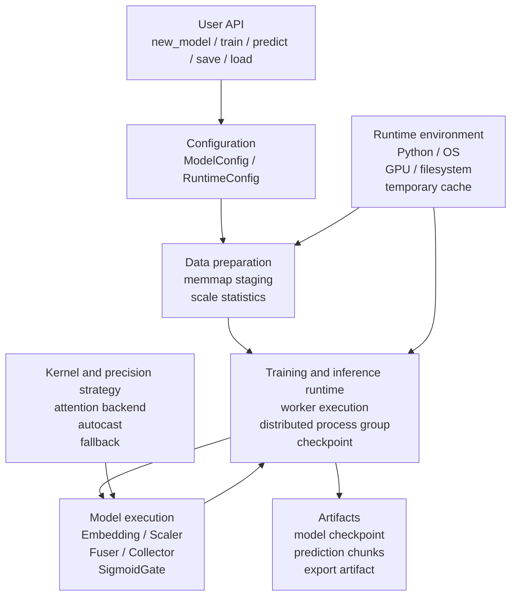
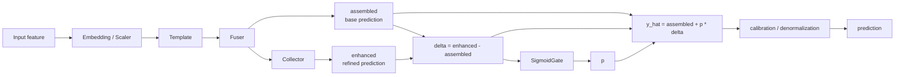
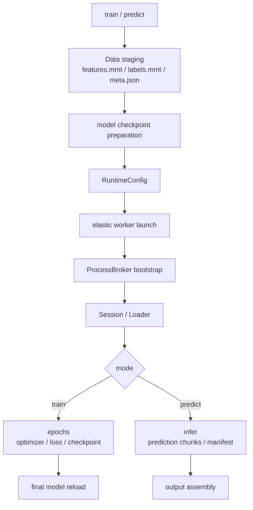

<p align="right">
  <a href="README.md">한국어</a> · <strong>English</strong>
</p>

# ENN-PyTorch

> A runtime-oriented PyTorch framework for spatio-temporal modeling, training, and inference

ENN-PyTorch is not just a model implementation. It is a framework that handles data preparation, model execution, training and inference runtime, checkpointing, prediction stabilization, and model export in a single execution flow.

This repository includes an end-to-end execution case using traffic-flow prediction data to verify that ENN-PyTorch can run training, prediction, and result generation on real data. This case is not intended to claim state-of-the-art performance on a traffic forecasting benchmark. It is intended to validate the framework's execution flow and runtime structure.

---

## Execution Validation

| Item | Description |
|---|---|
| Runtime environment | AWS EC2 g6e.2xlarge |
| GPU | NVIDIA L40S |
| Execution mode | Jupyter Notebook + Python 3.14t |
| Compile setting | `max-autotune` |
| Training | 100 epochs |
| Model composition | Fuser + Spatial Template + Temporal Template + Collector |
| Artifacts | Prediction result sheets, checkpoint, evaluation metrics |

<p align="center">
  
</p>

<p align="center">
  
</p>

---

## Visual Results

The result below is from a workflow validation case using traffic-flow prediction data. The goal is not to present prediction accuracy as the main achievement, but to verify that input data can pass through the training and inference runtime and produce output artifacts.

<p align="center">
  
</p>

<details>
<summary>View quantitative evaluation metrics</summary>

| Metric | Value |
|---|---:|
| Samples | 157,248 |
| MAE | 7.538 km/h |
| RMSE | 11.459 km/h |
| R² | 0.433 |
| MAPE | 10.802% |
| Prediction bias | 0.040 |
| Correlation r | 0.679 |

</details>

---

## What This Project Validates

ENN-PyTorch does not stop at implementing a single model. It connects the data, model, and runtime layers required for real execution into one workflow.

The repository demonstrates the following implementation scope:

- `memmap`-based data staging
- Fuser, Template, and Collector based model composition
- worker-based training and inference execution
- precision-aware kernel execution and fallback
- OOM recovery and batch/microbatch adjustment
- asynchronous distributed checkpointing and final model recovery
- prediction chunk, manifest, and output assembly
- export paths for ONNX, ORT, TensorRT, CoreML, LiteRT, PT2, AOTI, ExecuTorch, and others

---

## Overall Architecture



ENN-PyTorch starts from the user API, but the actual behavior is coordinated across data preparation, worker runtime, model execution, and artifact generation.

---

## Model Structure

The core prediction structure is `assembled + p * delta`. The Fuser produces the base prediction, the Collector produces a refinement candidate, and the SigmoidGate controls how much of the residual is applied.



This structure does not use the refined prediction directly as the final output. Instead, it dynamically controls the residual contribution.

---

## Training and Inference Runtime

`train()` and `predict()` do not simply repeat `model.forward()` inside the current Python process. They prepare input data and model state first, then execute training or inference inside a worker runtime.



The training runtime includes OOM recovery, nonfinite checks, and checkpoint saving. The inference runtime includes prediction collapse detection, comparison of `raw`/`posthoc`/`denorm` candidates, and result chunk assembly.

---

## Installation

Install the PyTorch build appropriate for your CUDA or CPU environment first.

```bash
pip install --upgrade pip
pip install -e .
```

Optional dependencies can be installed depending on the workflow.

---

## Quick Example

```python
import torch
import enn_torch

from enn_torch.core.config import ModelConfig
from enn_torch.runtime.losses import StudentsTLoss

cfg = ModelConfig(
    d_model=128,
    heads=4,
    device="cuda" if torch.cuda.is_available() else "cpu",
)

model = enn_torch.new_model(in_dim=16, out_shape=(1,), config=cfg)

x = torch.randn(32, 16, device=next(model.parameters()).device)
y = torch.randn(32, 1, device=next(model.parameters()).device)

loss_fn = StudentsTLoss()
opt = torch.optim.AdamW(model.parameters(), lr=1e-3)

model.train()
for _ in range(10):
    pred, loss = model(
        x,
        labels_flat=y.reshape(y.shape[0], -1),
        net_loss=loss_fn,
    )
    loss.backward()
    opt.step()
    opt.zero_grad(set_to_none=True)

model.eval()
with torch.no_grad():
    pred = model(x, return_loss=False)
```

---

## Repository Layout

```text
enn_torch/
  core/       # configuration, policies, precision, system utilities
  data/       # memmap staging, dataset, sampler, loader, stream
  nn/         # model structure, layers, blocks, kernels
  runtime/    # train/predict workflow, worker loop, distributed, export
notebook.ipynb
raw_data.xlsx
README.md
README.en.md
pyproject.toml
```

---

## Technical Documentation

Detailed architecture documentation is available separately.

- [ENN-PyTorch Technical Documentation](https://prnd-kimjeseok.notion.site/ENN-PyTorch-367602ff0db180a182a1f517f292f0ab)

The documentation covers the project overview, overall architecture, model structure, kernel and precision execution strategy, data pipeline, training and inference runtime, model saving and export, and operational debugging guide.

---

## License

Source code is licensed under the PolyForm Noncommercial License 1.0.0. See the repository license file for details.
