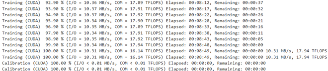
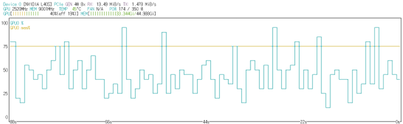
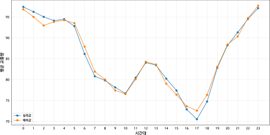
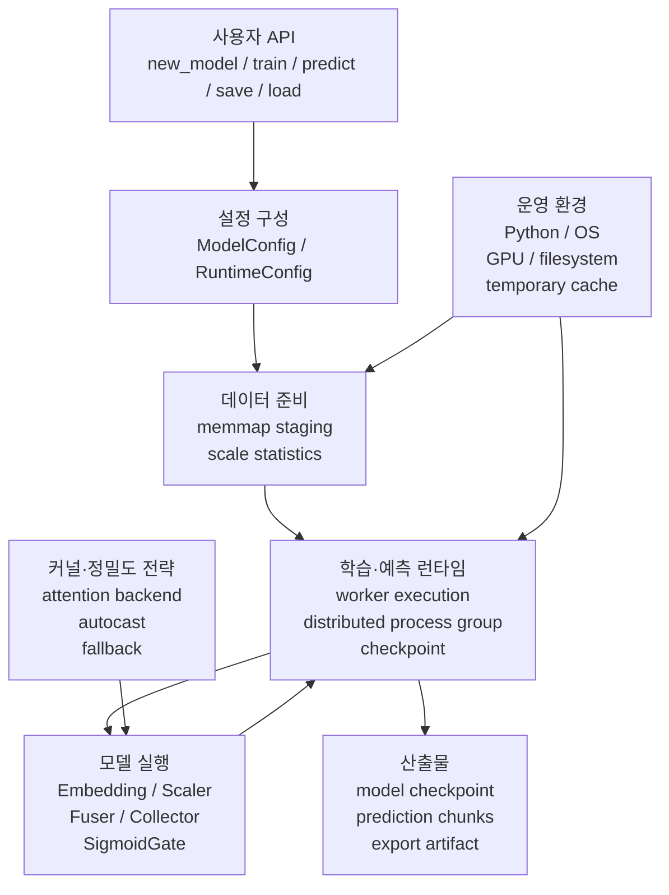
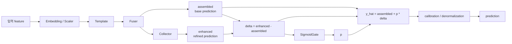
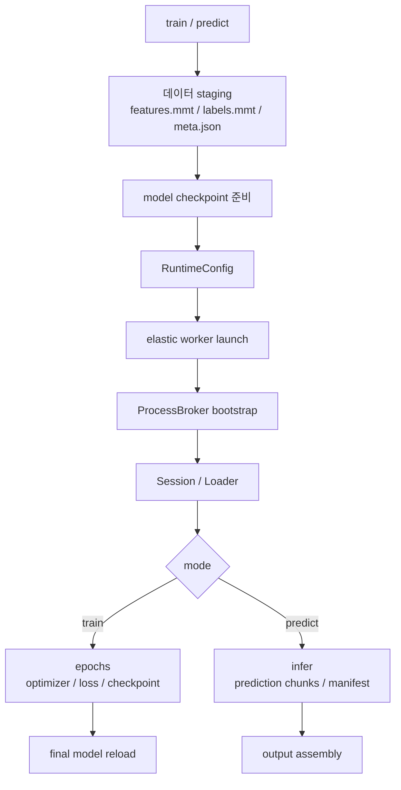

<p align="right">
  <a href="../README.md">언어 선택</a> · <strong>한국어</strong> · <a href="README.en.md">English</a>
</p>

# ENN-PyTorch

> PyTorch 기반 공간·시간성 모델링을 위한 런타임 중심 학습·예측 프레임워크

ENN-PyTorch는 단순한 모델 구현체가 아니라, 데이터 준비, 모델 실행, 학습·예측 런타임, checkpoint, 예측 안정화, 모델 내보내기를 하나의 실행 흐름 안에서 다루는 프레임워크입니다.

이 저장소는 ENN-PyTorch가 실제 데이터에서 학습, 예측, 결과 산출까지 수행되는지 확인하기 위해 교통 흐름 예측 데이터를 사용한 엔드투엔드 실행 사례를 포함합니다. 이 실행 사례는 특정 교통 예측 벤치마크의 최고 성능을 주장하기 위한 것이 아니라, 프레임워크의 실행 흐름과 런타임 구조를 검증하기 위한 사례입니다.

---

## 실행 검증

| 항목 | 내용 |
|---|---|
| 실행 환경 | AWS EC2 g6e.2xlarge |
| GPU | NVIDIA L40S |
| 실행 방식 | Jupyter Notebook + Python 3.14t |
| 컴파일 설정 | `max-autotune` |
| 학습 | 100 epochs |
| 모델 구성 | Fuser + Spatial Template + Temporal Template + Collector |
| 산출물 | 예측 결과 시트, checkpoint, 평가 지표 |

<p align="center">
  
</p>

<p align="center">
  
</p>

---

## 시각 결과

아래 결과는 교통 흐름 예측 데이터를 사용한 워크플로 검증 사례입니다. 예측 성능 자체보다, 입력 데이터가 학습·예측 런타임을 거쳐 결과 산출물로 이어지는 흐름을 확인하는 데 목적이 있습니다.

<p align="center">
  
</p>

<details>
<summary>정량 평가 지표 보기</summary>

| 지표 | 값 |
|---|---:|
| 표본 수 | 157,248 |
| MAE | 7.538 km/h |
| RMSE | 11.459 km/h |
| R² | 0.433 |
| MAPE | 10.802% |
| 예측 편향 | 0.040 |
| 상관계수 r | 0.679 |

</details>

---

## 프로젝트가 검증한 것

ENN-PyTorch는 모델 하나를 구현하는 데서 끝나지 않고, 실제 실행에 필요한 데이터·모델·런타임 계층을 하나의 흐름으로 연결합니다.

이 저장소에서 확인할 수 있는 핵심 구현 범위는 다음과 같습니다.

- `memmap` 기반 데이터 staging
- Fuser, Template, Collector 기반 모델 구성
- worker 기반 학습·예측 실행
- precision-aware kernel execution과 fallback
- OOM recovery와 batch/microbatch 조정
- 비동기 분산 checkpoint와 final model 회수
- prediction chunk, manifest, output assembly
- ONNX, ORT, TensorRT, CoreML, LiteRT, PT2, AOTI, ExecuTorch 등 export 경로

---

## 전체 구조



ENN-PyTorch의 실행 흐름은 사용자 API에서 시작하지만, 실제 동작은 데이터 준비, worker 런타임, 모델 실행, 결과물 저장 계층이 함께 맞물려 이루어집니다.

---

## 모델 구조

모델의 핵심 예측 구조는 `assembled + p * delta`입니다. Fuser가 base prediction을 만들고, Collector가 refinement 후보를 만든 뒤, SigmoidGate가 residual 반영량을 조절합니다.



이 구조는 refined prediction을 그대로 출력으로 사용하지 않고, residual 반영량을 동적으로 제어합니다.

---

## 학습·예측 런타임

`train()`과 `predict()`는 현재 Python 프로세스에서 단순히 `model.forward()`를 반복하는 방식이 아닙니다. 입력 데이터와 모델 상태를 준비한 뒤, worker runtime에서 학습 또는 예측을 실행합니다.



학습 런타임은 OOM recovery, nonfinite 검사, checkpoint 저장을 포함합니다. 예측 런타임은 prediction collapse 감지, `raw`/`posthoc`/`denorm` 후보 비교, 결과 chunk 조립을 포함합니다.

---

## 설치

PyTorch는 사용하는 CUDA 또는 CPU 환경에 맞게 먼저 설치하는 것을 권장합니다.

```bash
pip install --upgrade pip
pip install -e .
```

선택 의존성은 사용 목적에 따라 추가로 설치합니다.

---

## 빠른 예제

```python
import torch
import enn_torch

from enn_torch.core.config import ModelConfig
from enn_torch.runtime.losses import StudentsTLoss

cfg = ModelConfig(
    d_model=128,
    heads=4,
    device="cuda" if torch.cuda.is_available() else "cpu",
)

model = enn_torch.new_model(in_dim=16, out_shape=(1,), config=cfg)

x = torch.randn(32, 16, device=next(model.parameters()).device)
y = torch.randn(32, 1, device=next(model.parameters()).device)

loss_fn = StudentsTLoss()
opt = torch.optim.AdamW(model.parameters(), lr=1e-3)

model.train()
for _ in range(10):
    pred, loss = model(
        x,
        labels_flat=y.reshape(y.shape[0], -1),
        net_loss=loss_fn,
    )
    loss.backward()
    opt.step()
    opt.zero_grad(set_to_none=True)

model.eval()
with torch.no_grad():
    pred = model(x, return_loss=False)
```

---

## 저장소 구조

```text
enn_torch/
  core/       # 설정, 정책, 정밀도, 시스템 유틸리티
  data/       # memmap staging, dataset, sampler, loader, stream
  nn/         # 모델 구조, layer, block, kernel
  runtime/    # train/predict workflow, worker loop, distributed, export
docs/
  README.ko.md
  README.en.md
  assets/
notebook.ipynb
raw_data.xlsx
README.md
pyproject.toml
```

---

## 기술 문서

상세 구조 설명은 별도 기술 문서에서 다룹니다.

- [ENN-PyTorch 기술 문서](https://prnd-kimjeseok.notion.site/ENN-PyTorch-367602ff0db180a182a1f517f292f0ab)

문서에는 프로젝트 개요, 전체 아키텍처, 모델 구조, 커널과 정밀도 실행 전략, 데이터 파이프라인, 학습 및 예측 런타임, 모델 저장과 내보내기, 운영 리스크와 디버깅 가이드를 정리했습니다.

---

## 라이선스

Source code is licensed under the PolyForm Noncommercial License 1.0.0. See the repository license file for details.
